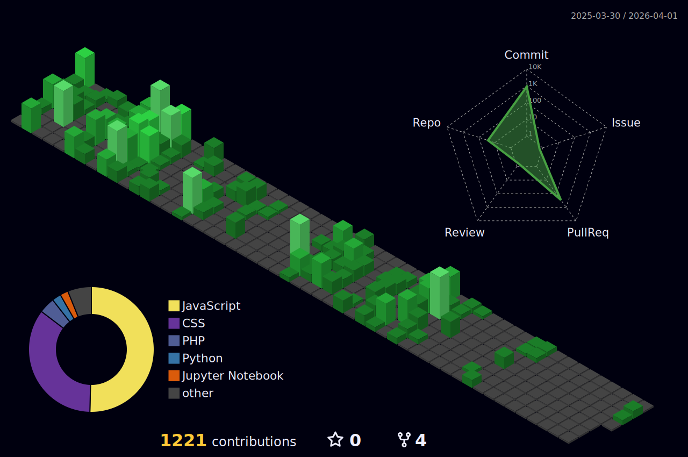

# Hi there 👋

I am **Aqil Yoga Pramono**, a **student** of Informatics Engineering at Electronic Engineering Polytechnic Institute of Surabaya, interested in **AI** and **Back‑end** development.

---

<h4 align="center" style="font-size: 2.0em;">
  <strong>English</strong> | 
  <a href="languageSkill/README.ID.md">Bahasa Indonesia</a>
</h4>

---

## About Me

- 😄 **Full Name:** Aqil Yoga Pramono  
- 🎓 **Currently Studying:** Informatics Engineering, Electronic Engineering Polytechnic Institute of Surabaya  
- 🌱 **Interests:** Artificial Intelligence, Back‑end Development  

---

## GitHub Overview

---

## Most Used Languages

  

---

## Contribution Activity

  

---

## Contributions in the Last Year

  

---

## Let’s Connect and Build Something!

  

